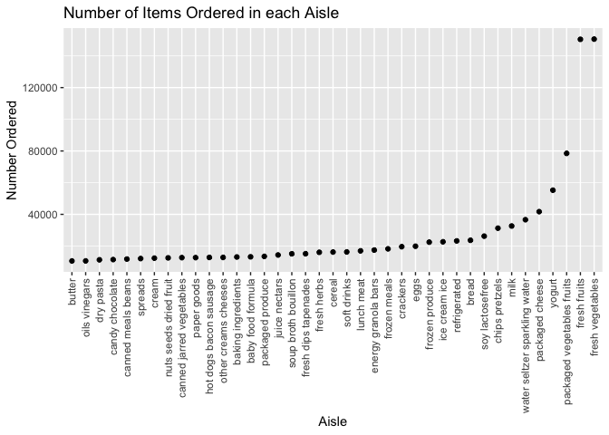
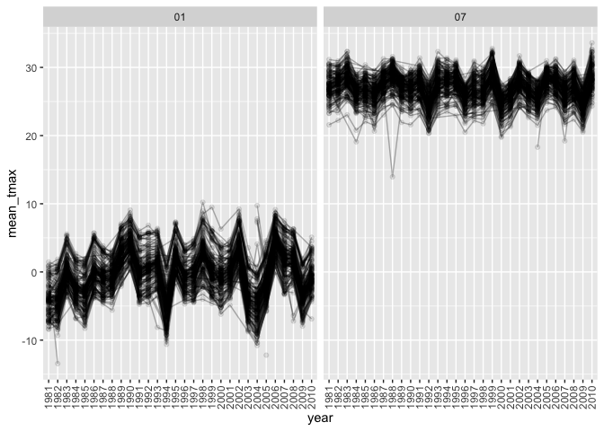
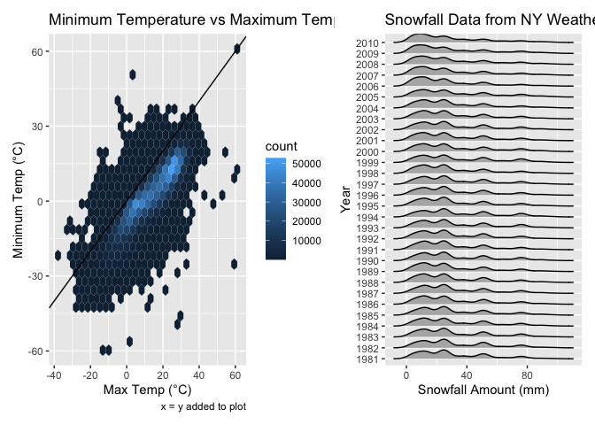

Homework 3
================
Jared Klug

``` r
library(tidyverse)
```

    ## ── Attaching packages ─────────────────────────────────────────────────────────────────────────────────────────────── tidyverse 1.3.0 ──

    ## ✓ ggplot2 3.3.2     ✓ purrr   0.3.4
    ## ✓ tibble  3.0.3     ✓ dplyr   1.0.2
    ## ✓ tidyr   1.1.2     ✓ stringr 1.4.0
    ## ✓ readr   1.3.1     ✓ forcats 0.5.0

    ## ── Conflicts ────────────────────────────────────────────────────────────────────────────────────────────────── tidyverse_conflicts() ──
    ## x dplyr::filter() masks stats::filter()
    ## x dplyr::lag()    masks stats::lag()

``` r
library(p8105.datasets)
library(ggridges)
library(patchwork)
```

## Problem 1

``` r
data("instacart")
```

The instacart dataset comes from Instacart, an online grocery shopping
service, from 2017. With 1384617 observations and 15 variables,
instacart contains the following variables:

  - **order\_id**: Order identifier number (1 - 3421070)

  - **product\_id**: Product identifier number (1-49688)

  - **add\_to\_cart\_order**: Designates order at which product was
    added to cart by order\_id

  - **reordered**: Indicates if product has been ordered by user in the
    past. (1: yes, 0: no)

  - **user\_id**: Customer identification number

  - **eval\_set**: Which evaluation set this order belongs in

  - **order\_number**: Indicates order sequence of order\_id by user

  - **order\_dow**: Indicates day of the week the order was placed (0-6)

  - **order\_hour\_of\_day**: Indicates hour of the day the order was
    placed (0-23)

  - **days\_since\_prior\_order**: Days since last order (0-30, if more
    than 30 days - observation is 30)

  - **product\_name**: Name of the product

  - **aisle\_id**: Aisle Identification Number (1-134)

  - **department\_id**: Department Identification Number (1-21)

  - **aisle**: Name of the aisle by aisle\_id

  - **department**: Name of the department by department\_id

  - **How many aisles are there, and which aisles are the most items
    ordered from?**

This dataset contains info on both the user and the products, allowing
us to identify trends in either user behavior or product specifications.
Across the 21 departments, there are 134 aisles and 49688 unique
products to choose from.

``` r
instacart %>% 
    count(aisle) %>% 
    arrange(desc(n))
```

    ## # A tibble: 134 x 2
    ##    aisle                              n
    ##    <chr>                          <int>
    ##  1 fresh vegetables              150609
    ##  2 fresh fruits                  150473
    ##  3 packaged vegetables fruits     78493
    ##  4 yogurt                         55240
    ##  5 packaged cheese                41699
    ##  6 water seltzer sparkling water  36617
    ##  7 milk                           32644
    ##  8 chips pretzels                 31269
    ##  9 soy lactosefree                26240
    ## 10 bread                          23635
    ## # … with 124 more rows

The most popular items ordered are fruits and vegetables, followed by
dairy, water, and snack products.

  - **Make a plot that shows the number of items ordered in each aisle,
    limiting this to aisles with more than 10000 items ordered. Arrange
    aisles sensibly, and organize your plot so others can read it.**

<!-- end list -->

``` r
instacart %>% 
    count(aisle) %>% 
    filter(n > 10000) %>% 
    mutate(
        aisle = factor(aisle),
        aisle = fct_reorder(aisle, n)
    ) %>% 
    ggplot(aes(x = aisle, y = n)) + 
    geom_point() + 
    theme(axis.text.x = element_text(angle = 90, vjust = 0.5, hjust = 1)) +
  labs( 
    title = "Number of Items Ordered in each Aisle",
    x = "Aisle", 
    y = "Number Ordered"
  )
```

<!-- -->

As pointed out by the count function before, we see the same top aisles
to be fruits and veggies, this plot is able to visualize just how much
more fruits and vegetables are ordered compared to any other item by
aisle.

  - **Make a table showing the three most popular items in each of the
    aisles “baking ingredients”, “dog food care”, and “packaged
    vegetables fruits”. Include the number of times each item is ordered
    in your table**

<!-- end list -->

``` r
instacart %>% 
    filter(aisle %in% c("baking ingredients", "dog food care", "packaged vegetables fruits")) %>% 
    group_by(aisle) %>% 
    count(product_name) %>% 
    mutate(rank = min_rank(desc(n))) %>% 
    filter(rank < 4) %>% 
    arrange(aisle, rank) %>% 
  select(-rank) %>% 
    knitr::kable()
```

| aisle                      | product\_name                                 |    n |
| :------------------------- | :-------------------------------------------- | ---: |
| baking ingredients         | Light Brown Sugar                             |  499 |
| baking ingredients         | Pure Baking Soda                              |  387 |
| baking ingredients         | Cane Sugar                                    |  336 |
| dog food care              | Snack Sticks Chicken & Rice Recipe Dog Treats |   30 |
| dog food care              | Organix Chicken & Brown Rice Recipe           |   28 |
| dog food care              | Small Dog Biscuits                            |   26 |
| packaged vegetables fruits | Organic Baby Spinach                          | 9784 |
| packaged vegetables fruits | Organic Raspberries                           | 5546 |
| packaged vegetables fruits | Organic Blueberries                           | 4966 |

In the baking ingredients, the 3 most popular items are light brown
sugar, pure backing soda, and cane sugar. For dog food care, the top
ordered items are treats, oragnix dog food, and small dog biscuits. The
most popular packaged vegetable/fruit is baby spinach followed by
raspberries then blueberries.

  - **Make a table showing the mean hour of the day at which Pink Lady
    Apples and Coffee Ice Cream are ordered on each day of the week;
    format this table for human readers (i.e. produce a 2 x 7 table).**

<!-- end list -->

``` r
instacart %>% 
    filter(product_name %in% c("Pink Lady Apples", "Coffee Ice Cream")) %>% 
    group_by(product_name, order_dow) %>% 
    summarize(mean_hour = mean(order_hour_of_day)) %>% 
    pivot_wider(
        names_from = order_dow,
        values_from = mean_hour
    ) %>% 
  knitr::kable()
```

    ## `summarise()` regrouping output by 'product_name' (override with `.groups` argument)

| product\_name    |        0 |        1 |        2 |        3 |        4 |        5 |        6 |
| :--------------- | -------: | -------: | -------: | -------: | -------: | -------: | -------: |
| Coffee Ice Cream | 13.77419 | 14.31579 | 15.38095 | 15.31818 | 15.21739 | 12.26316 | 13.83333 |
| Pink Lady Apples | 13.44118 | 11.36000 | 11.70213 | 14.25000 | 11.55172 | 12.78431 | 11.93750 |

From this table we can see that apples are typically ordered before ice
cream, with the exception of the weekday 5. We can assume that earlier
in the day people may be more inclined to order healthy foods while
later in the day people are more likely to indulge in their sweet-tooth
craving.

## Problem 2

  - **Load, tidy, and otherwise wrangle the data. Your final dataset
    should include all originally observed variables and values; have
    useful variable names; include a weekday vs weekend variable; and
    encode data with reasonable variable classes. Describe the resulting
    dataset (e.g. what variables exist, how many observations, etc).**

<!-- end list -->

``` r
activity_df = read.csv("./data/accel_data.csv") %>% 
  pivot_longer(activity.1:activity.1440,
               names_to = "minute_of_day",
               names_prefix = "activity.",
               values_to = "activity_count"
  ) %>% 
  mutate(
    weekday_or_weekend = ifelse(day == "Saturday" | day == "Sunday", "weekend", "weekday"),
    minute_of_day = as.integer(minute_of_day)
  ) %>% 
  mutate(
    day = factor(day, levels = c("Sunday", "Monday", "Tuesday", "Wednesday", "Thursday", "Friday", "Saturday"))
  )
```

The accelerometer data taken from a 63 yr-old male with BMI of 25, with
50400 observations and 6 variables, contains the following variables:

  - **week**: integer type designating which week the data was recorded
    from week 1 to week 5

  - **day\_id**: integer type designating which day of the 5 week period
    the data was recorded from day 1 to day 35

  - **day**: factor type designating the day of the week to the
    corresponding data

  - **minute\_of\_day**: integer type designating the minute of the day
    starting at midnight from minute 1 to minute 1440

  - **activity\_count**: numeric type that measures accelerometer data
    that can be translated into physcial activity levels.

  - **weekday\_or\_weekend**: character type that says if the
    corresponding data was taken on a weekday or weekend

  - **Traditional analyses of accelerometer data focus on the total
    activity over the day. Using your tidied dataset, aggregate accross
    minutes to create a total activity variable for each day, and create
    a table showing these totals. Are any trends apparent?**

<!-- end list -->

``` r
activity_df %>% 
  group_by(week, day) %>% 
  summarize(total_activity = sum(activity_count)) %>% 
  pivot_wider(
    names_from = "day",
    values_from = "total_activity"
  ) %>%
  knitr::kable(digits = 0)
```

    ## `summarise()` regrouping output by 'week' (override with `.groups` argument)

| week | Sunday | Monday | Tuesday | Wednesday | Thursday | Friday | Saturday |
| ---: | -----: | -----: | ------: | --------: | -------: | -----: | -------: |
|    1 | 631105 |  78828 |  307094 |    340115 |   355924 | 480543 |   376254 |
|    2 | 422018 | 295431 |  423245 |    440962 |   474048 | 568839 |   607175 |
|    3 | 467052 | 685910 |  381507 |    468869 |   371230 | 467420 |   382928 |
|    4 | 260617 | 409450 |  319568 |    434460 |   340291 | 154049 |     1440 |
|    5 | 138421 | 389080 |  367824 |    445366 |   549658 | 620860 |     1440 |

It is hard to detect any trends in the table without more exploratory
analysis.

  - **Accelerometer data allows the inspection activity over the course
    of the day. Make a single-panel plot that shows the 24-hour activity
    time courses for each day and use color to indicate day of the week.
    Describe in words any patterns or conclusions you can make based on
    this graph.**

<!-- end list -->

``` r
activity_df %>%
  ggplot(aes(x = minute_of_day, y = activity_count, color = day)) + 
  geom_smooth(se = FALSE) +
  labs(
    title = "24Hr Activity Plot Over 5 Weeks",
    x = "Minute of the Day (min)", 
    y = "Activity Count (arbitrary unit)",
    caption = "Accelerometer data of a 63yr old male with BMI of 25 over 5 weeks"
  )
```

    ## `geom_smooth()` using method = 'gam' and formula 'y ~ s(x, bs = "cs")'

<!-- -->

There were too many points to plot for a scatterplot to be interpreted.
I opted to only keep a smoothed version as it will average the activity
counts over the weeks for each day and present a more aesthetic graph.

From the plot we can see that at the start of the day we see very low
activity, assuming that is this particular person sleeping. At around 6
am this person seems to wake up and start their day, indicated by the
rise in activity level at around the 250-300 minute mark. This person
then remains awake/active steadily throughout the week from minute 375
to 1250. This person seems to be less active during Saturdays compared
to the rest of the week. This person also seems to be more active in the
later half of the day with the exception of Sunday.

## Problem 3

``` r
data("ny_noaa")
```

This dataset contains 2595176 rows and 7 columns.

Observations made in this dataset are from NY based weather stations.
The following variables are included in this dataset:

  - **id**: There are 747 distinct weather stations reporting data

  - **date**: The dates corresponding to the reported weather data are
    from 1981-01-01 – 2010-12-31

  - **prcp**: Precipitation data reported in tenths of mm are reported.
    Indicates how much rain on a given day (\# NAs: 145838)

  - **snow**: Snowfall data reported in mm. Indicates how much snow has
    fallen on a given day (\# NAs: 381221)

  - **snwd**: Snow depth data reported in mm. Indicates the max depth of
    snow on the ground on a given day (\# NAs: 591786)

  - **tmax**: Maximum temperature on a given day reported in tenths of
    °C. (\# NAs: 1134358)

  - **tmin**: Minimum temperature on a given day reported in tenths of
    °C. (\# NAs: 1134420)

The number of NA’s in this dataset is concerning, especially if we want
to do an analysis over the total period of time. However, for certain
variables it is less significant than others. We can assume that for the
days that the observations report NA values for prcp, snow, and snwd
that it did not rain nor snow on those days. However, if we want to do
an analysis of min and max temperature variations over the whole time
period, we cannot feasibly accomplish this due to the missing values.

  - **Do some data cleaning. Create separate variables for year, month,
    and day. Ensure observations for temperature, precipitation, and
    snowfall are given in reasonable units. For snowfall, what are the
    most commonly observed values? Why?**

<!-- end list -->

``` r
ny_noaa_df = ny_noaa %>% 
  separate(date, into = c("year", "month", "day"), sep = "-") %>% 
  mutate(
    tmax = as.integer(tmax),
    tmin = as.integer(tmin)
  ) %>% 
  mutate(
    prcp = prcp / 10,
    tmax = tmax / 10,
    tmin = tmin / 10
  )

ny_noaa_df %>% 
  count(snow) %>%
  drop_na() %>% 
  arrange(desc(n))
```

    ## # A tibble: 281 x 2
    ##     snow       n
    ##    <int>   <int>
    ##  1     0 2008508
    ##  2    25   31022
    ##  3    13   23095
    ##  4    51   18274
    ##  5    76   10173
    ##  6     8    9962
    ##  7     5    9748
    ##  8    38    9197
    ##  9     3    8790
    ## 10   102    6552
    ## # … with 271 more rows

0mm is the most commonly reported value for snowfall, which makes sense
as it only snows during the winter, and even then it is unlikely to snow
during the winter. The following most common snowfall amounts range from
\~ 5 - 100mm which is not much snowfall, probably what you would expect
on a given day when it actually snows.

  - **Make a two-panel plot showing the average max temperature in
    January and in July in each station across years. Is there any
    observable / interpretable structure? Any outliers?**

<!-- end list -->

``` r
ny_noaa_df %>% 
  filter(month %in% c("01", "07")) %>% 
  group_by(id, month,year) %>% 
  summarise(mean_tmax = mean(tmax, na.rm = TRUE)) %>% 
  ggplot(aes(x = year, y = mean_tmax, group = id)) +
  geom_point(alpha = .1) + 
  geom_path(alpha = .3) +
  facet_grid(. ~ month) +
  theme(axis.text.x = element_text(angle = 90, vjust = 0.5, hjust = 1))
```

    ## `summarise()` regrouping output by 'id', 'month' (override with `.groups` argument)

    ## Warning: Removed 5970 rows containing missing values (geom_point).

    ## Warning: Removed 5640 row(s) containing missing values (geom_path).

<!-- -->

It is tough to see with so many points and lines overlapping each other,
but it is clear that all the weather stations in NY report similar
temperature ranges between each other with the exception of some
outliers. We can interpret from the plot that January is colder than
July and that the temperature ranges from \~ -10°C to 10°C and 20°C to
35°C respectively.

  - **Make a two-panel plot showing (i) tmax vs tmin for the full
    dataset (note that a scatterplot may not be the best option); and
    (ii) make a plot showing the distribution of snowfall values greater
    than 0 and less than 100 separately by year.**

<!-- end list -->

``` r
tmax_tmin_plot = 
  ny_noaa_df %>% 
  ggplot(aes(x = tmax, y = tmin)) +
  geom_hex() +
  geom_abline(slope=1, intercept=0) +
  labs(
    title = "Minimum Temperature vs Maximum Temperature",
    x = "Max Temp (°C)", 
    y = "Minimum Temp (°C)",
    caption = "x = y added to plot"
  )
  
snow_plot = 
  ny_noaa_df %>% 
  drop_na(snow) %>% 
  filter(
    snow > 0, 
    snow < 100,
  ) %>% 
  ggplot(aes(x = snow, y = year)) +
  geom_density_ridges(scale = .85) +
  labs( 
    title = "Snowfall Data from NY Weather Stations: 1981 to 2010",
    x = "Snowfall Amount (mm)", 
    y = "Year"
  )

tmax_tmin_plot + snow_plot
```

    ## Warning: Removed 1136276 rows containing non-finite values (stat_binhex).

    ## Picking joint bandwidth of 3.76

<!-- -->
