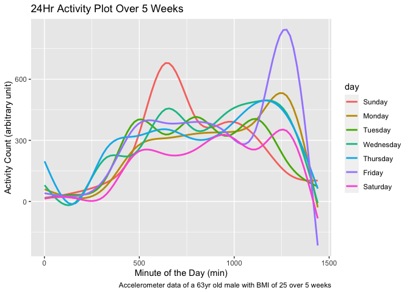

Homework 3
================
Jared Klug

``` r
library(tidyverse)
```

    ## ── Attaching packages ─────────────────────────────────────────────────────────────────────────────────────────────── tidyverse 1.3.0 ──

    ## ✓ ggplot2 3.3.2     ✓ purrr   0.3.4
    ## ✓ tibble  3.0.3     ✓ dplyr   1.0.2
    ## ✓ tidyr   1.1.2     ✓ stringr 1.4.0
    ## ✓ readr   1.3.1     ✓ forcats 0.5.0

    ## ── Conflicts ────────────────────────────────────────────────────────────────────────────────────────────────── tidyverse_conflicts() ──
    ## x dplyr::filter() masks stats::filter()
    ## x dplyr::lag()    masks stats::lag()

``` r
library(p8105.datasets)
```

## Problem 1

## Problem 2

  - **Load, tidy, and otherwise wrangle the data. Your final dataset
    should include all originally observed variables and values; have
    useful variable names; include a weekday vs weekend variable; and
    encode data with reasonable variable classes. Describe the resulting
    dataset (e.g. what variables exist, how many observations, etc).**

<!-- end list -->

``` r
activity_df = read.csv("./data/accel_data.csv") %>% 
  pivot_longer(activity.1:activity.1440,
               names_to = "minute_of_day",
               names_prefix = "activity.",
               values_to = "activity_count"
               ) %>% 
  mutate(
    weekday_or_weekend = ifelse(day == "Saturday" | day == "Sunday", "weekend", "weekday"),
    minute_of_day = as.integer(minute_of_day)
         ) %>% 
  mutate(
    day = factor(day, levels = c("Sunday", "Monday", "Tuesday", "Wednesday", "Thursday", "Friday", "Saturday"))
        )
```

The accelerometer data taken from a 63 yr-old male with BMI of 25, with
50400 observations and 6 variables, contains the following variables:

  - **week**: integer type designating which week the data was recorded
    from week 1 to week 5

  - **day\_id**: integer type designating which day of the 5 week period
    the data was recorded from day 1 to day 35

  - **day**: factor type designating the day of the week to the
    corresponding data

  - **minute\_of\_day**: integer type designating the minute of the day
    starting at midnight from minute 1 to minute 1440

  - **activity\_count**: numeric type that measures accelerometer data
    that can be translated into physcial activity levels.

  - **weekday\_or\_weekend**: character type that says if the
    corresponding data was taken on a weekday or weekend

  - **Traditional analyses of accelerometer data focus on the total
    activity over the day. Using your tidied dataset, aggregate accross
    minutes to create a total activity variable for each day, and create
    a table showing these totals. Are any trends apparent?**

<!-- end list -->

``` r
activity_df %>% 
  group_by(week, day) %>% 
  summarize(total_activity = sum(activity_count)) %>% 
  pivot_wider(
    names_from = "day",
    values_from = "total_activity"
  ) %>%
  knitr::kable(digits = 0)
```

    ## `summarise()` regrouping output by 'week' (override with `.groups` argument)

| week | Sunday | Monday | Tuesday | Wednesday | Thursday | Friday | Saturday |
| ---: | -----: | -----: | ------: | --------: | -------: | -----: | -------: |
|    1 | 631105 |  78828 |  307094 |    340115 |   355924 | 480543 |   376254 |
|    2 | 422018 | 295431 |  423245 |    440962 |   474048 | 568839 |   607175 |
|    3 | 467052 | 685910 |  381507 |    468869 |   371230 | 467420 |   382928 |
|    4 | 260617 | 409450 |  319568 |    434460 |   340291 | 154049 |     1440 |
|    5 | 138421 | 389080 |  367824 |    445366 |   549658 | 620860 |     1440 |

It is hard to detect any trends in the table without more exploratory
analysis.

  - **Accelerometer data allows the inspection activity over the course
    of the day. Make a single-panel plot that shows the 24-hour activity
    time courses for each day and use color to indicate day of the week.
    Describe in words any patterns or conclusions you can make based on
    this graph.**

<!-- end list -->

``` r
activity_df %>% 
  ggplot(aes(x = minute_of_day, y = activity_count)) +
  geom_point(aes(color = day))
```

<!-- -->

## Problem 3

``` r
data("ny_noaa")
```

This dataset contains 2595176 rows and 7 columns.

Observations made in this dataset are from NY based weather stations.
The following variables are included in this dataset:

  - **id**: There are 747 distinct weather stations reporting data

  - **date**: The dates corresponding to the reported weather data are
    from 1981-01-01 – 2010-12-31

  - **prcp**: Precipitation data reported in tenths of mm are reported.
    Indicates how much rain on a given day (\# NAs: 145838)

  - **snow**: Snowfall data reported in mm. Indicates how much snow has
    fallen on a given day (\# NAs: 381221)

  - **snwd**: Snow depth data reported in mm. Indicates the max depth of
    snow on the ground on a given day (\# NAs: 591786)

  - **tmax**: Maximum temperature on a given day reported in tenths of
    °C. (\# NAs: 1134358)

  - **tmin**: Minimum temperature on a given day reported in tenths of
    °C. (\# NAs: 1134420)

The number of NA’s in this dataset is concerning, especially if we want
to do an analysis over the total period of time. However, for certain
variables it is less significant than others. We can assume that for the
observation days that report NA values for prcp, snow, and snwd that it
did not rain nor snow on those days. However, if we want to do an
analysis of min and max temperature variations over the whole time
period, we cannot feasibly accomplish this due to the missing values.

  - **Do some data cleaning. Create separate variables for year, month,
    and day. Ensure observations for temperature, precipitation, and
    snowfall are given in reasonable units. For snowfall, what are the
    most commonly observed values? Why?**

\#\#\`\`\`{r clean\_ny\_noaa}

ny\_noaa %\>% separate(date, into = c(“year”, “month”, “day”), sep =
“-”) %\>% mutate( prcp = prcp / 10, tmax = tmax / 10, tmin = tmin /
10 )

\`\`\`
